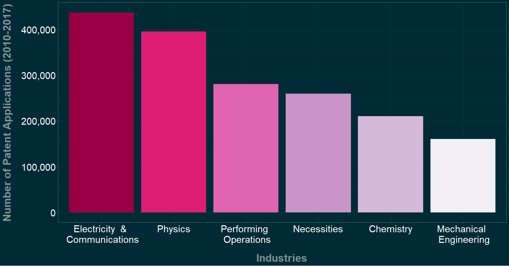
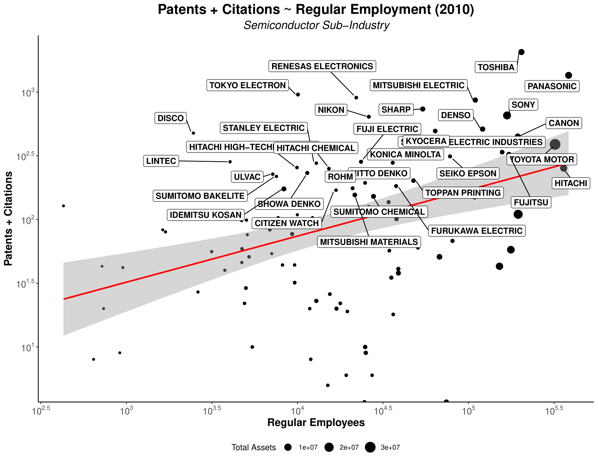

```{r setup, include=FALSE}
options(htmltools.dir.version = FALSE)
```

```{r xaringan-themer, include=FALSE, warning=FALSE}
library(xaringanthemer)
style_solarized_light()
```


```{r metathis, echo=FALSE}
library(metathis)
meta() %>%
  meta_name("github-repo" = "ko-suta/Academic-Website") %>% 
  meta_social(
    title = "The Role of Labor Flexibility in the Pursuit of Innovation Strategies by Established Japanese Companies.",
    description = paste(
      "Seeking the optimal balance between regular and flexible employees that would enhance corporate innovation.",
      "Presented at 2019 SASE Annual Meeting."
    ),
    url = "https://kovsiannikov.com/slides/new",
    image = "https://kovsiannikov.com/images/Industries-Distribution.png",
    image_alt = paste(
      "Title slide of Build your own universe:", 
      "Scale high-quality research data provisioning with R packages,", 
      "presented at at 2019 SASE Annual Meeting by Kostiantyn Ovsiannikov"
    ),
    og_type = "website",
    og_author = "Kostiantyn Ovsiannikov",
    twitter_card_type = "summary_large_image",
    twitter_creator = "@ko_suta"
  )
```

#  Does labor flexibility benefit innovation?

.pull-left[
* **Merits** 
  + Easier reallocation to more dynamic sectors
  + More incentives to take risks
  + Job matches 🢂 productivity
  + "Fresh blood" inflow
]

.pull-right[
* **Demerits**
  + Stronger labor protection 🢂 higher wages and productivity
  + Development of firm-specific skills
  + Trust 🢂 productivity
  + Innovation requires long-term incentives, not short-term punishments (Kleinknecht et al., 2014)
]

---
#  Focus & Literature gap 

* Focus on **numerical labor flexibility**
  + "addresses the variation of quantity of labor input" (Arvantis, 2005),
  + reflects the ability of firms to use the external labor market to replace regular employees and/or to use temporary employees on fixed-term and part-time contracts, often through temporary employment agencies? (Kato & Zhou, 2018).
  
* **Literature gap** 
  + previous studies on this topic have mostly concentrated on European cases. Only Kato & Zhou (2018) have recently conducted the study on Japan's startup companies 
  + Kato & Zhou (2018) innovation proxy is a dummy variable (yes/no), mine is the number of applications and citations 

---
# Distribution of patent applications across industries 



---
# "Electricity" subindustries with most patent applications 


---
# "Necessities" subindustries with most patent applications  


---
#  Companies with highest numbers of patent applications 

.pull-left[
* **Electricity & Communications**
  + Panasonic: 15009
  + Toshiba: 14028
  + Mitsubishi Electric: 13219
  + Canon: 13165
  + Toyota Motor: 10150
  + Sharp: 8874
  + Fujitsu: 8075
  + Sony: 7530
]

.pull-right[
* **Necessities**
  + Sankyo : 9168
  + Sega Sammy Holdings : 3896
  + Universal Entertainment : 2886
  + Heiwa : 2434
  + Terumo: 2272
  + Fujishoji : 2253
  + Iseki: 1859
  + Unicharm : 1441
]

---
#  Methodology 


* **(Sub-) Industries analyzed** 
  + Electricity and Communications 🢂 "Semiconductors" 
  + Necessities 🢂 "Games"

* **Sources:**
  + The Institute of Intellectual Property Patent Database (IIP-DB): patent application data. Companies having > 5 applications (Lechevalier et al., 2010)
  + Nikkei NEEDS Financial Database: corporate data

* **Innovation proxy (dependent variable)**
  + Patent applications: "represent the development of new and technically feasible devices" (Kato & Zhou, 2018) — `quantity aspect` 
  + Patent citations — `quality aspect` (Acharya, Baghai et al., 2010)

---

#  Possible conceptualization 

* **Visible innovations** — overcoming commoditization along established lines. Value results from function.

* **Invisible innovations** (Kusunoki, 2006)
  + "Rather than boosting existing dimensions, it paints an entirely new picture of how, why, and to whom a new product or service should appeal" (ibid). `Value ~ function` is unclear 
  + "Once a company succeeds in establishing a new product concept, it is often able to produce powerful loyalty and brand effects that trump dimensional superiority" (ibid).
  + Importance of product-customer interaction

* Japan is relatively **weak** in knowledge-based industries. **Gaming industry** as an exception (Aoyama & Izushi, 2003).
* Japan's **dual labor market** 🢂 possibility of transition from non-regular to regular employment is only 1.7 to 10.3 percent. **Gaming industry** as an exception (Casper & Storz, 2016).

---


---
# "Semiconductors" Sub-Industry — Correlations  


```{r tbl12, echo = FALSE}
tbl12 <- tibble::tribble(
~` `, ~`Patents + Citations`, ~`Age`, ~`Regulars`, ~`Nonregulars (%)`, ~`R&D Intensity`, ~`Internationalization`, ~`Total Assets`, ~`Process Innovation`, ~`Labor Intensity`,
"Patents + Citations"," ","0.02","0.372***","-0.017","0.181***","-0.007","0.157***","0.002","-0.015",
"Age"," "," ","0.135***","0.063","-0.223***","-0.223***","0.007","0.043","-0.133***",
"Regulars"," "," "," ","0.025","0.080**","0.009","0.767***","0.232***","-0.215***",
"Nonregulars (%)"," "," "," "," ","-0.191***","-0.111*","0.120**","0.003","0.185**",
"R&D Intensity"," "," "," "," "," ","0.347***","-0.028","-0.024","0.038",
"Internationalization"," "," "," "," "," "," ","0.072**","0.028","0.090**",
"Total Assets"," "," "," "," "," "," "," ","0.311***","-0.222***",
"Process Innovation"," "," "," "," "," "," "," "," ","-0.207***",
"Labor Intensity"," "," "," "," "," "," "," "," "," "
)

kableExtra::kable_styling(knitr::kable(tbl12), font_size = 18)
```


---




---
# "Games" Sub-Industry — Correlations  


```{r tbl14, echo = FALSE}
tbl14 <- tibble::tribble(
~` `, ~`Patents + Citations`, ~`Age`, ~`Regulars`, ~`Nonregulars`, ~`R&D Intensity`, ~`Internationalization`, ~`Total Assets`, ~`Process Innovation`, ~`Labor Intensity`,
"Patents + Citations"," ","-0.068*","-0.128***","0.452***","0.225***","-0.108**","-0.092**","0.012","-0.140***",
"Age"," "," ","0.259***","-0.225***","-0.127***","0.186***","0.086**","0.064*","-0.257***",
"Regulars"," "," "," ","-0.078","0.006","0.296***","0.775***","0.218***","-0.162***",
"Nonregulars"," "," "," "," ","-0.017","-0.176**","0.028","-0.023","-0.225**",
"R&D Intensity"," "," "," "," "," ","0.065","-0.041","-0.005","-0.091*",
"Internationalization"," "," "," "," "," "," ","0.292***","0.165***","-0.143**",
"Total Assets"," "," "," "," "," "," "," ","0.307***","-0.155***",
"Process Innovation"," "," "," "," "," "," "," "," ","-0.170***",
"Labor Intensity"," "," "," "," "," "," "," "," "," "
)

kableExtra::kable_styling(knitr::kable(tbl14), font_size = 18)
```


---


---
#  Variables Selection 🢂 Operationalization 

* `Process innovation`: Investment / Capital Stock (Brouwer & Kleinknecht, 1997; Sterlacchini, 1998; Fukao, Ikeuchi et al., 2017)
* `Internationalization`: Exports / Sales
* `R&D Intensity`: R&D / Sales
* `Labor Intensity`: Labor Costs / Fixed Assets


---
#  Regression results (?Semiconductors?)Dependent variable: Patents + Citations 


```{r tbl17, echo = FALSE}
tbl17 <- tibble::tribble(
~`Independent Variables`, ~`Fixed Effects ? Time`, ~`Random Effects`, ~`Fixed Effects ? Time (2)`, ~`Random Effects (2)`,
"Regular Employees","0.002 ***","0.001 *","0.0004 ***","0.001 ***",
"Non-Regular Employees (%)"," "," ","114.734 **","8.669",
"R&D Intensity","810.913 ***","288.18","614.197 ***","777.505 ***",
"Internationalization","22.052","-198.865 ***","-41.451 ***","-56.614 ***",
"Total Assets","34.546 ***","66.454 ***","7.132","-0.485",
"Process Innovation","-11.794 ***","-6.627 **","-1.252 **","-3.702 ***",
"Age","-18.681","-122.066 ***","-21.797 ***","-38.396 **",
"Constant","============================","-123.75","==================================","203.775 *",
"Observations","1,005 (97 companies; 2005 ? 2018)","1,005 (97 companies; 2005 ? 2018)","299 (55 companies; 2010 ? 2018)","299 (55 companies; 2010 ? 2018)",
"Adjusted ","0.242","0.042","0.207","0.159",
"Note:	*p<0.1; **p<0.05; ***p<0.01"," "," "," "," ",
"Independent Variables","Fixed Effects ? Time","Random Effects","Fixed Effects ? Time (2)","Random Effects (2)",
"Regular Employees","0.002 ***","0.001 *","0.0004 ***","0.001 ***",
"Non-Regular Employees (%)"," "," ","114.734 **","8.669",
"R&D Intensity","810.913 ***","288.18","614.197 ***","777.505 ***",
"Internationalization","22.052","-198.865 ***","-41.451 ***","-56.614 ***",
"Total Assets","34.546 ***","66.454 ***","7.132","-0.485",
"Process Innovation","-11.794 ***","-6.627 **","-1.252 **","-3.702 ***",
"Age","-18.681","-122.066 ***","-21.797 ***","-38.396 **",
"Constant","============================","-123.75","==================================","203.775 *",
"Observations","1,005 (97 companies; 2005 ? 2018)","1,005 (97 companies; 2005 ? 2018)","299 (55 companies; 2010 ? 2018)","299 (55 companies; 2010 ? 2018)",
" ","0.242","0.042","0.207","0.159",
"Note:	*p<0.1; **p<0.05; ***p<0.01"," "," "," "," "
)

kableExtra::kable_styling(knitr::kable(tbl17), font_size = 18)
```


---
#  Regression results (?Games?)Dependent variable: Patents + Citations 


```{r tbl18, echo = FALSE}
tbl18 <- tibble::tribble(
~`Independent Variables`, ~`Fixed Effects ? Time`, ~`Random Effects`, ~`Fixed Effects ? Time (2)`,
"Regular Employees","-0.0001","-0.0001","-0.0003 ***",
"Non-Regular Employees (%)","310.648 ***","198.375 ***"," ",
"R&D Intensity","225.587 ***","39.554","802.370 ***",
"Total Assets","0.445","2.295","3.382",
"Process Innovation","0.19","-0.41","1.370 **",
"Age","0.138","-0.107","-0.072",
"Constant","==================","-32.131","====================",
"Observations","280 (53 companies; 2010 ? 2018)","280 (53 companies; 2010 ? 2018)","745 (81 companies; 2010 ? 2018)",
"Adjusted ","0.245","0.043","0.084",
"Note:	*p<0.1; **p<0.05; ***p<0.01"," "," "," ",
"Independent Variables","Fixed Effects ? Time","Random Effects","Fixed Effects ? Time (2)",
"Regular Employees","-0.0001","-0.0001","-0.0003 ***",
"Non-Regular Employees (%)","310.648 ***","198.375 ***"," ",
"R&D Intensity","225.587 ***","39.554","802.370 ***",
"Total Assets","0.445","2.295","3.382",
"Process Innovation","0.19","-0.41","1.370 **",
"Age","0.138","-0.107","-0.072",
"Constant","==================","-32.131","====================",
"Observations","280 (53 companies; 2010 ? 2018)","280 (53 companies; 2010 ? 2018)","745 (81 companies; 2010 ? 2018)",
" ","0.245","0.043","0.084",
"Note:	*p<0.1; **p<0.05; ***p<0.01"," "," "," "
)

kableExtra::kable_styling(knitr::kable(tbl18), font_size = 18)
```


---
#  Tentative conclusions 

.pull-left[
* **Semiconductors**
  + Crucial role of `R&D` for innovation, which is linked to `Product Innovation` 🢂
  + Negative role of `Process Innovation` 🢂
  + `Regulars` (and, possibly, `Non-Regulars`) play an important role 🢀
  + 🢀 Positive impact of both **innovation output** (`Patents`) and **innovation input** (`R&D`) on employment
  + `Larger` and `younger` companies are more innovative
]

.pull-right[
* **Games**
  + Important role of `R&D` for innovation
  + Crucial role of numerical labor flexibility, measured as `Non-regulars' share`
  + Investment in fixed assets (🢂 `Process Innovation` ) — important for services 🢂
  + 🢂 Adjustment of `regulars`
  + 🢀 Negative impact of **innovation output** (`Patents`); positive impact of **innovation input** (`R&D`) on employment
]

---
#  Additional Findings  

+ **Older**  manufacturing firms struggle to innovate (Anderson & Eshima, 2013)
+ **Younger**  manufacturing firms employing **non-regulars** innovate more
+ **Internationalization** is associated with less innovation for manufacturing companies employing **non-regulars**

---
class: inverse, center, middle

#  THANK YOU FOR YOUR ATTENTION 

